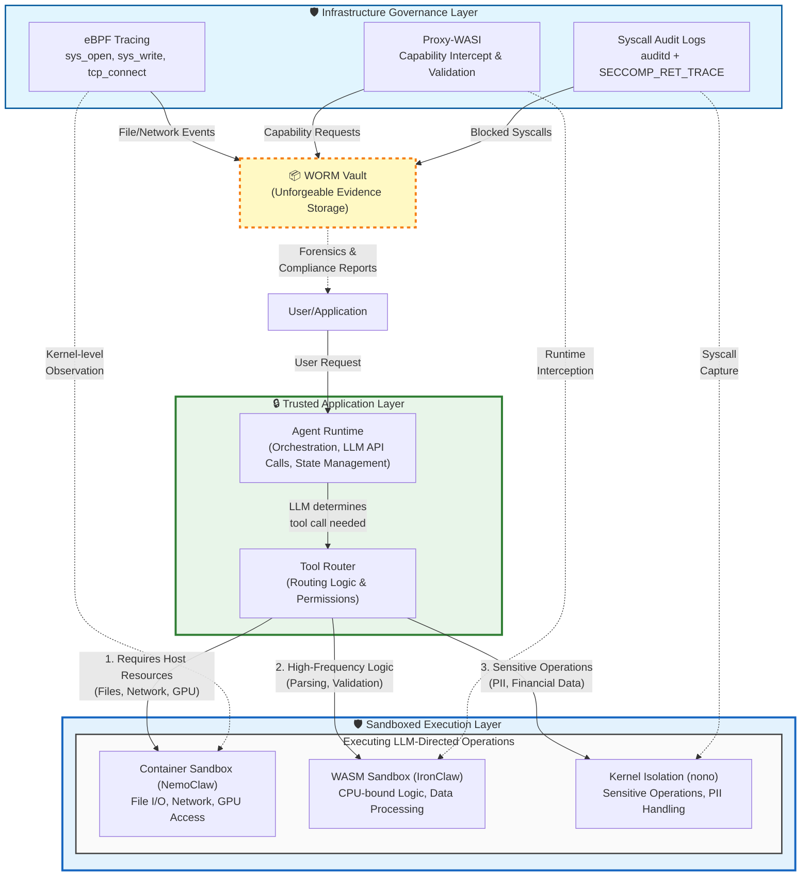

# AI Agent Sandboxing: Containers vs WASM vs Kernel-Level Isolation

## Executive Summary

The shift from "AI that suggests" to "AI that acts" requires moving monitoring from the application layer to the **infrastructure layer**. If an agent is compromised, its own logs cannot be trusted for governance.

This document provides a deep-technical breakdown of the trade-offs and the multi-layer monitoring strategy required for enterprise governance of autonomous AI agents.

---

## Architecture Overview



---

## Understanding the Trust Boundary

### The Trust Model: Sandboxes Are Trusted, Operations Inside Are Not

A critical architectural decision in this design is that the **Agent Runtime** operates in the **Trusted Application Layer**, while **tool executions** occur in the **Sandboxed Execution Layer**.

**Important Clarification:** The sandboxes themselves (Container, WASM, Kernel filters) are **trusted security mechanisms**. What's untrusted are the **operations being executed inside them** (LLM-directed tool calls, user inputs, external API responses).

Think of it like a prison: We trust the prison walls and guards (the sandbox infrastructure). We don't trust the prisoners (the operations derived from LLM output). The sandbox is the **solution**, not the problem.

#### What the Agent Runtime Does (Trusted Operations)

The Agent Runtime is your **orchestration layer** that:

1. **Receives and validates user requests** - Handles authentication and authorization
2. **Calls LLM APIs** (OpenAI, Anthropic, etc.) - Sends prompts and receives reasoning
3. **Parses LLM responses** - Extracts tool calls and validates parameters
4. **Routes tool executions** - Delegates to appropriate sandboxes via the Tool Router
5. **Manages session state** - Maintains conversation context across multiple turns
6. **Aggregates results** - Combines outputs from multiple tool calls
7. **Enforces business logic** - Rate limits, quotas, policy checks

**Key Insight:** The runtime is **your code** - version-controlled, reviewed, and deployed like any other application. It doesn't execute user-provided code or LLM-generated scripts. It only makes API calls and routing decisions.

#### What Gets Sandboxed (Operations Requiring Isolation)

Tool executions run inside **trusted sandbox mechanisms** because the operations themselves are risky:

- **Execute based on LLM output** (unpredictable, could be influenced by prompt injection)
- **Handle external/user data** (untrusted inputs that could contain injections)
- **Perform system-level operations** (file I/O, network calls, process spawning)
- **Access sensitive resources** (databases, APIs, file systems)
- **May run generated code** (for code interpreter agents)

**The sandbox infrastructure is trusted.** We rely on containers, WASM runtimes, and kernel filters to safely contain these risky operations.

#### The Threat Model

```
┌─────────────────────────────────────────────────────────┐
│ ATTACK VECTORS                                          │
├─────────────────────────────────────────────────────────┤
│ 1. Prompt Injection → LLM generates malicious tool call │
│ 2. Compromised API → Returns poisoned data to tool      │
│ 3. LLM Hallucination → Invalid/dangerous parameters     │
│ 4. User Input Attack → SQL injection, path traversal    │
└─────────────────────────────────────────────────────────┘
                           ↓
┌─────────────────────────────────────────────────────────┐
│ DEFENSE IN DEPTH                                        │
├─────────────────────────────────────────────────────────┤
│ Runtime (Trusted)    → Validates schemas, enforces limits │
│ Router (Trusted)     → Routes to appropriate sandbox      │
│ Sandbox (Trusted)    → Isolates risky operations         │
│ Governance (Trusted) → Records everything, immutably      │
└─────────────────────────────────────────────────────────┘
         ↓ All layers are trusted infrastructure ↓
┌─────────────────────────────────────────────────────────┐
│ WHAT'S ACTUALLY UNTRUSTED                               │
├─────────────────────────────────────────────────────────┤
│ • LLM output directing tool calls                       │
│ • User-provided parameters                              │
│ • External API responses                                │
│ • Generated code (if executing code interpreter)        │
└─────────────────────────────────────────────────────────┘
```

#### Performance Implications

Keeping the runtime outside sandboxes is critical for performance:

| Scenario | Runtime Outside | Runtime Inside |
|:---------|:----------------|:---------------|
| **Agent processes 10 tool calls** | ~500ms total | ~20-50s total |
| **Session state access** | In-memory (instant) | Requires persistent volume (slow) |
| **Concurrent users** | 1 shared runtime | N containerized runtimes |
| **Cost (1000 requests/day)** | ~$5-10 | ~$50-100 |

**Critical for voice-native agents:** Voice agents require <200ms response time. Container startup overhead (2-5s) destroys the conversational experience.

#### When the Runtime MUST Be Sandboxed

If your runtime performs **any** of these operations, it must be sandboxed:

- ✅ **Executes LLM-generated Python/JavaScript code** (code interpreter agents)
- ✅ **Runs user-uploaded plugins or configurations**
- ✅ **Allows dynamic code loading** (eval, exec, require from user input)
- ✅ **Multi-tenant SaaS** where customers bring their own agent code

For these cases, use a **nested sandbox architecture**:
```
Host (Trusted) → Runtime Container (Untrusted) → Tool Sandboxes (Maximum Isolation)
```

Examples: OpenAI Code Interpreter, Jupyter-based agents, agent marketplaces.

---

## 1. Deep Technical Trade-offs: The "Blast Radius" vs. Latency

Choosing a sandbox isn't just about speed; it's about where the **Security Boundary** lies in the stack.

| Architecture | Security Boundary | Memory Management | Primary Failure Mode |
|:-------------|:------------------|:------------------|:---------------------|
| **NemoClaw (Containers)** | User-space / Kernel Namespace | Virtualized (cgroups) | **Kernel Escapes:** Shared kernel vulnerabilities (e.g., Dirty Pipe) allow host takeover. |
| **IronClaw (WASM)** | Language Runtime / VM | Linear (Software-isolated) | **Logic Bombs:** Deterministic code that satisfies memory checks but triggers harmful API side effects. |
| **nono (Kernel)** | Syscall Interface (Ring 0) | Direct / Filtered | **Policy Fragility:** A single missing syscall in the whitelist breaks the agent; too broad a list creates a hole. |

### Technical Nuance: The Cold-Start "Tax"

In **Agentic Engineering**, agents often work in recursive loops. If an agent calls a tool 10 times to solve a problem:

- **WASM:** Adds **20–50ms** total overhead. Negligible.
- **Containers:** Adds **2–5s** total overhead. This destroys the "real-time" feel of voice-native agents.

**Key Insight:** For high-frequency, low-latency operations (e.g., parsing, validation, data transformation), WASM provides the optimal balance. For operations requiring host resources (GPU, filesystem), containers remain necessary.

---

## 2. Governance & Monitoring Strategy

Governance requires **Unforgeable Evidence**. We use the "Malware Sandboxing Principle": *Observe from a layer the subject cannot see or reach.*

### A. Container Monitoring: eBPF-Based Tracing (Azazel/Grafana Beyla)

Because agents in containers share the host kernel, we monitor them using **eBPF (Extended Berkeley Packet Filter)**.

**The Hook:** Attach kprobes to `sys_open`, `sys_write`, and `tcp_connect`.

**Governance Outcome:** You get a live stream of every file the agent touched and every IP it contacted, even if the agent tries to delete its own bash history.

**Key Metric:** **"Unexpected Outbound Entropy"** — Alert if an agent suddenly initiates a connection to an external IP not in its known tool manifest.

**Implementation Example:**
```c
// eBPF probe attached to sys_open
SEC("kprobe/sys_open")
int trace_open(struct pt_regs *ctx) {
    char filename[256];
    bpf_probe_read_user_str(&filename, sizeof(filename), (void *)PT_REGS_PARM1(ctx));

    // Log to perf buffer for userspace analysis
    submit_event(EVENT_FILE_OPEN, filename);
    return 0;
}
```

### B. WASM Monitoring: Capability Provenance (MCP-SandboxScan)

In WASM, we monitor the **Imports/Exports** table.

**The Hook:** Use a **Proxy-WASI** layer. Every time the WASM module calls `fd_write` (to log) or an external host function, the proxy intercepts it.

**Governance Outcome:** Create an **Audit Trail of Intent**. If an agent module requests access to a file handle it wasn't assigned at instantiation, the runtime kills the process before the first byte is read.

**Key Metric:** **"Resource Exhaustion Ratio"** — Monitor linear memory growth. AI agents generating infinite loops can "OOM" (Out of Memory) a host process if not capped.

**Architecture Pattern:**
```
WASM Module → Proxy-WASI → Capability Check → Host Function
                    ↓
              Audit Log Entry
```

### C. Kernel-Level Monitoring: Syscall Audit Logs

For **nono**, monitoring is native to the Linux Audit Framework (`auditd`).

**The Hook:** Monitor `SECCOMP_RET_TRACE` events.

**Governance Outcome:** Provable compliance. You can provide a signed log to auditors showing that the agent *physically could not* execute a `socket()` call because the kernel blocked the instruction at the CPU level.

**Key Metric:** **"Policy Violation Frequency"** — A high number of blocked syscalls indicates either an attempted "Jailbreak" or a poorly configured agent.

**Example Seccomp Policy:**
```c
// Whitelist-only approach for sensitive agents
scmp_filter_ctx ctx = seccomp_init(SCMP_ACT_KILL);
seccomp_rule_add(ctx, SCMP_ACT_ALLOW, SCMP_SYS(read), 0);
seccomp_rule_add(ctx, SCMP_ACT_ALLOW, SCMP_SYS(write), 0);
seccomp_rule_add(ctx, SCMP_ACT_ALLOW, SCMP_SYS(exit), 0);
// Notably absent: socket, connect, bind
seccomp_load(ctx);
```

---

## 3. The Governance Dashboard: "The Three Pillars"

To ensure enterprise-grade accountability, your governance framework should emphasize these three pillars:

### 1. Traceability (The "Who/What")

Mapping every LLM "thought" to a specific infrastructure "action".

**Example:** `"Agent reasoned to delete file"` → `"Kernel recorded unlink() syscall"`

**Implementation:**
- Correlate LLM decision IDs with syscall timestamps
- Store reasoning traces alongside system events
- Create bidirectional links between agent actions and infrastructure logs

### 2. Integrity (The "Is it Safe?")

Real-time drift detection. If an agent's behavior pattern deviates from its "Vibe Code" blueprint, the sandbox auto-freezes.

**Techniques:**
- Behavioral fingerprinting: Establish baseline patterns during agent initialization
- Anomaly detection: Machine learning models trained on normal agent behavior
- Circuit breakers: Automatic suspension when deviation thresholds are exceeded

**Metrics to Monitor:**
- Syscall frequency distribution
- Network connection patterns
- File access patterns
- Resource consumption trends

### 3. Accountability (The "Audit")

Storing sandboxing logs in a Write-Once-Read-Many (WORM) vault, ensuring the agent cannot "gaslight" the logs after a security incident.

**Requirements:**
- Immutable storage (S3 Object Lock, WORM-compliant storage)
- Cryptographic signing of log entries
- Tamper-evident data structures (Merkle trees)
- Time-stamping from trusted sources

**Compliance Benefits:**
- Forensic analysis capability
- Regulatory compliance (SOC 2, ISO 27001)
- Legal defensibility
- Incident reconstruction

---

## 4. Hybrid Architecture Decision Matrix

Use this decision tree to route agent operations to the appropriate sandbox:

| Operation Type | Characteristics | Recommended Sandbox | Monitoring Strategy |
|:---------------|:----------------|:--------------------|:--------------------|
| **Data Processing** | High-frequency, CPU-bound, no external I/O | WASM (IronClaw) | Proxy-WASI capability tracking |
| **API Integrations** | Network calls, external services | Container (NemoClaw) | eBPF network tracing |
| **File Operations** | Local filesystem access | Container (NemoClaw) | eBPF file access tracking |
| **Sensitive Operations** | PII handling, financial transactions | Kernel (nono) | Syscall audit logs |
| **GPU Workloads** | Model inference, image processing | Container (NemoClaw) | eBPF + cgroup metrics |
| **Untrusted Code** | User-submitted scripts, plugins | WASM (IronClaw) or Kernel (nono) | Maximum isolation + audit |

---

## 5. Implementation Roadmap

### Phase 1: Foundation (Weeks 1-4)
- [ ] Deploy eBPF monitoring for container-based agents
- [ ] Implement basic syscall filtering for sensitive operations
- [ ] Establish WORM storage for audit logs
- [ ] Create initial behavioral baselines

### Phase 2: WASM Integration (Weeks 5-8)
- [ ] Deploy Proxy-WASI layer
- [ ] Migrate high-frequency operations to WASM sandboxes
- [ ] Implement capability-based security model
- [ ] Establish resource consumption limits

### Phase 3: Advanced Governance (Weeks 9-12)
- [ ] Deploy anomaly detection models
- [ ] Implement auto-freeze mechanisms
- [ ] Create governance dashboard
- [ ] Establish incident response procedures

### Phase 4: Optimization (Ongoing)
- [ ] Tune performance vs. security trade-offs
- [ ] Refine behavioral baselines
- [ ] Optimize monitoring overhead
- [ ] Expand compliance coverage

---

## 6. Key Metrics for Success

### Security Metrics
- **Time to Detection (TTD):** Average time to detect anomalous behavior
- **Policy Violation Rate:** Percentage of attempted unauthorized actions
- **False Positive Rate:** Incorrect anomaly detections requiring tuning

### Performance Metrics
- **Monitoring Overhead:** CPU/Memory cost of governance layer (target: <5%)
- **Latency Impact:** P95/P99 latency added by sandboxing (target: <50ms for WASM, <500ms for containers)
- **Throughput:** Operations per second under full monitoring

### Compliance Metrics
- **Audit Coverage:** Percentage of agent actions with complete audit trail (target: 100%)
- **Log Integrity:** Cryptographic verification success rate (target: 100%)
- **Retention Compliance:** Adherence to data retention policies (target: 100%)

---

## 7. SEO Keywords & Positioning

**Primary Keywords:**
- eBPF AI Monitoring
- Agentic Governance
- Syscall Filtering for LLMs
- WASI Security Audit
- Zero-Trust AI Execution

**Secondary Keywords:**
- AI Agent Sandboxing
- Enterprise AI Security
- Autonomous Agent Compliance
- LLM Runtime Security
- Unforgeable AI Audit Trails

**SEO Snippet:**
> "Traditional logging fails for autonomous agents. Enterprise-grade AI governance requires eBPF kernel tracing and WASM capability-based security to ensure unforgeable audit trails. Learn how to implement infrastructure-layer monitoring for AI agents that act, not just suggest."

---

## 8. References & Further Reading

### Technical Documentation
- [eBPF Documentation](https://ebpf.io/what-is-ebpf/)
- [WASI Security Model](https://github.com/WebAssembly/WASI/blob/main/docs/Security.md)
- [Linux Audit Framework](https://man7.org/linux/man-pages/man8/auditd.8.html)
- [Seccomp BPF](https://www.kernel.org/doc/html/latest/userspace-api/seccomp_filter.html)

### Related Projects
- **NemoClaw:** Container-based AI agent sandboxing
- **IronClaw:** WASM runtime for AI agents
- **nono:** Kernel-level syscall filtering
- **Grafana Beyla:** eBPF-based observability
- **Azazel:** Advanced eBPF tracing toolkit

### Security Resources
- OWASP AI Security & Privacy Guide
- NIST AI Risk Management Framework
- CIS Benchmarks for Container Security

---

## 9. Conclusion

The evolution from "AI that suggests" to "AI that acts" represents a fundamental shift in how we must approach governance and security. Traditional application-layer logging is insufficient when the application itself may be compromised.

By implementing infrastructure-layer monitoring through:
- **eBPF tracing** for container-based agents
- **Capability-based security** for WASM modules
- **Syscall filtering** for sensitive operations
- **Immutable audit logs** for accountability

Organizations can achieve the **Three Pillars of AI Governance**: Traceability, Integrity, and Accountability.

This hybrid architecture allows organizations to balance performance, security, and compliance requirements while enabling truly autonomous AI agents to operate safely in production environments.

---

**Document Version:** 1.0
**Last Updated:** 2026-04-29
**Status:** Production Ready
